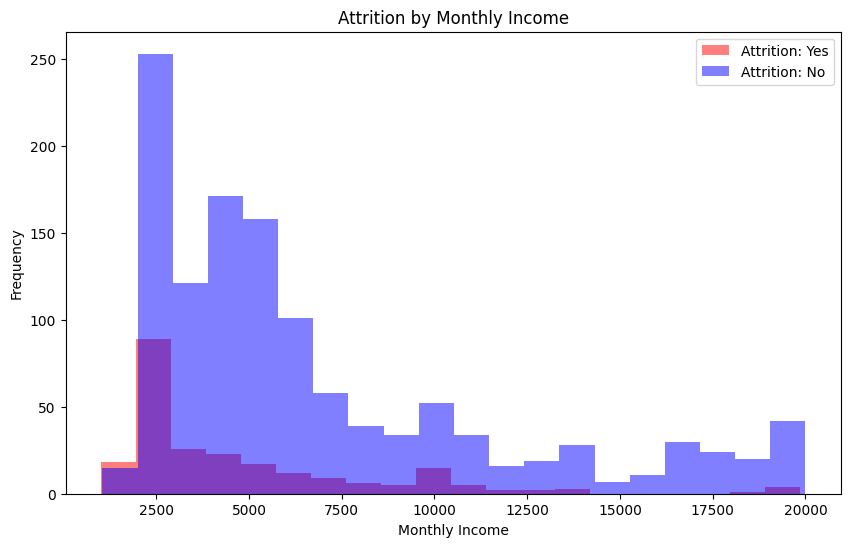
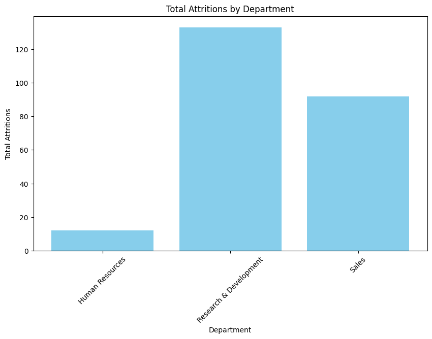
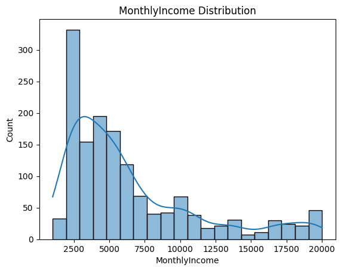

# HR Data Analytics
                                              HR Data Analytics Project (MeriSkills) 

<table style="width: 100%;">
  <tr>
    <td style="width: 50%; text-align: center;"></td>
    <td style="width: 50%; text-align: center;"></td>
    <td style="width: 50%; text-align: center;"></td>
  
    
  

  </tr>
</table

📊 Welcome to my HR Attrition Data Analysis project! In this initiative, I delved into HR data to uncover valuable insights regarding employee attrition. By analyzing patterns, trends, and contributing factors, we aim to formulate actionable strategies to enhance employee retention and engagement.

**Project Objectives:**

**Data Exploration:** Dive deep into HR data to extract meaningful insights.

**Attrition Analysis:** Identify patterns, correlations, and trends related to employee attrition.

**Recommendations:** Formulate data-driven recommendations to address attrition challenges.

**Key Insights:**

**📈 Attrition Rate**: A significant attrition rate of 16.21% was discovered.

**🏢 Departmental Trends:** The Research and Development department showed the highest attrition.

**👩‍🦰 Gender Dynamics:** Single males exhibited the highest attrition rate.

**⏰ Overtime Impact:** Employees working overtime had a higher attrition rate.

**🎓 Education Level:** Attrition rates varied based on educational backgrounds.

**Conclusion:**

The dataset reveals a significant attrition rate of 16.21%. Attrition is higher in the Research and Development department, among single males, and employees who work overtime. Average age and tenure of departing employees are 33 years and 8 years, respectively. Bachelor's degree holders and those with moderate job satisfaction show higher attrition. Further analysis is needed to understand and address the underlying reasons for attrition and develop retention strategies.

**Why This Project Matters:**

**🌟 Data-Driven Decision-Making:** Equip HR professionals with data-driven insights for strategic decision-making.

**💡 Enhancing Employee Retention:** The findings can be used to develop tailored strategies for retaining talent.

**📚 Learning Experience**: As part of my MeriSkill Internship, this project has been a valuable learning journey in data analytics.
